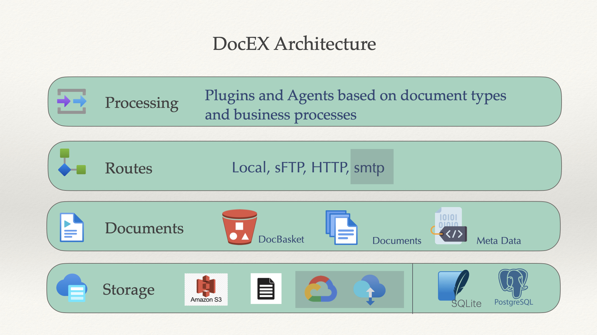

# DocEX Python API Reference



This reference covers the main public classes and methods in DocEX. For more details and advanced usage, see the [Developer Guide](Developer_Guide.md).

---

## DocEX

The main entry point for all document and transport operations.

```python
from docex import DocEX

# Create an instance
docEX = DocEX()

# List baskets
baskets = docEX.list_baskets()

# Get a basket
basket = docEX.basket('mybasket')

# List routes
routes = docEX.list_routes()

# Get a route
route = docEX.get_route('local_backup')
```

---

## DocBasket

A container for related documents.

```python
# Add a document
doc = basket.add('path/to/file.txt', metadata={'source': 'example'})

# List documents
for doc in basket.list():
    print(doc.name)

# Remove a document
basket.remove(doc.id)
```

---

## Document

Represents an individual document and its metadata.

```python
# Get document details
print(doc.get_details())

# Get content
text = doc.get_content(mode='text')

# Get and update metadata
meta = doc.get_metadata()
doc.update_metadata({'my_key': 'my_value'})

# Get document operations
ops = doc.get_operations()

# Get metadata as a plain dictionary
meta_dict = doc.get_metadata_dict()
```

---

## Route

Represents a transport route for uploading, downloading, and managing files.

```python
# Upload a document
result = route.upload_document(doc)
print(result.message)

# Download a file
result = route.download('remote_file.txt', 'local_file.txt')
print(result.message)

# List files
result = route.list_files()
print(result.details)
```

---

## BaseProcessor & Processor Registration

Processors transform or extract data from documents. You can create and register your own.

```python
from docex.processors.base import BaseProcessor, ProcessingResult
from docex.document import Document

class MyTextProcessor(BaseProcessor):
    def can_process(self, document: Document) -> bool:
        return document.name.lower().endswith('.txt')

    def process(self, document: Document) -> ProcessingResult:
        text = self.get_document_text(document)
        return ProcessingResult(success=True, content=text.upper())

# Register via CLI
# docex processor register --name MyTextProcessor --type content_processor --description "Uppercases text files" --config '{}'
```

---

## MetadataService

Service for managing document metadata.

```python
from docex.services.metadata_service import MetadataService

# Get metadata
meta = MetadataService().get_metadata(doc.id)

# Update metadata
MetadataService().update_metadata(doc.id, {'key': 'value'})
```

---

## UserContext (for audit logging)

```python
from docex.context import UserContext
from docex import DocEX

user_context = UserContext(user_id="user123", user_email="user@example.com", roles=["admin"])
docEX = DocEX(user_context=user_context)
```

---

## File History

Track file movements and history for a document.

```python
from docex.services.document_service import DocumentService
from docex.db.connection import Database

# Get file history for a document
db = Database()
service = DocumentService(db, basket_id)
history = service.get_file_history(doc.id)
for entry in history:
    print(entry.original_path, entry.internal_path)
```

---

## Duplicate Detection

Check for and mark duplicate documents.

```python
from docex.services.document_service import DocumentService
from docex.db.connection import Database

# Check for duplicates
db = Database()
service = DocumentService(db, basket_id)
info = service.check_for_duplicates(source, checksum)
print(info['is_duplicate'])

# Mark a document as duplicate
service.mark_as_duplicate(dup_id, orig_id)
```

---

## Operation Tracking

Track document operations and their dependencies.

```python
# Get document operations
ops = doc.get_operations()
for op in ops:
    print(op['operation_type'], op['status'])

# Get operation dependencies
from docex.db.repository import BaseRepository
deps = BaseRepository.get_dependencies(operation_id)
```

---

## Advanced Metadata

Retrieve extended metadata for a document.

```python
# Get all metadata as a plain dictionary
meta_dict = doc.get_metadata_dict()
```

---

## More
- See the [Developer Guide](Developer_Guide.md) for advanced topics, configuration, and extensibility.
- See the [Design Document](DocEX_Design.md) for architecture and design principles. 